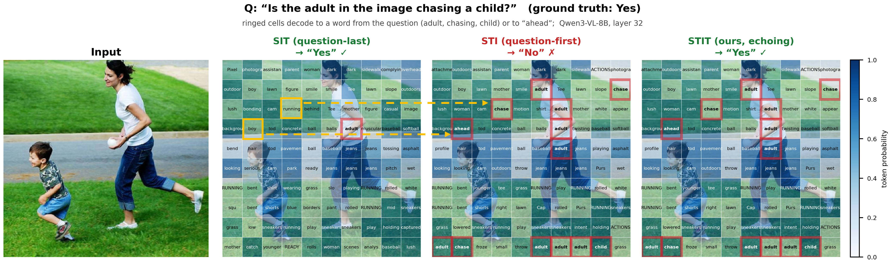
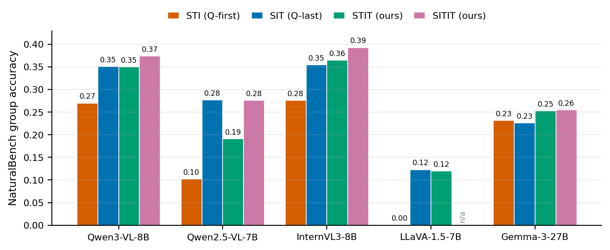
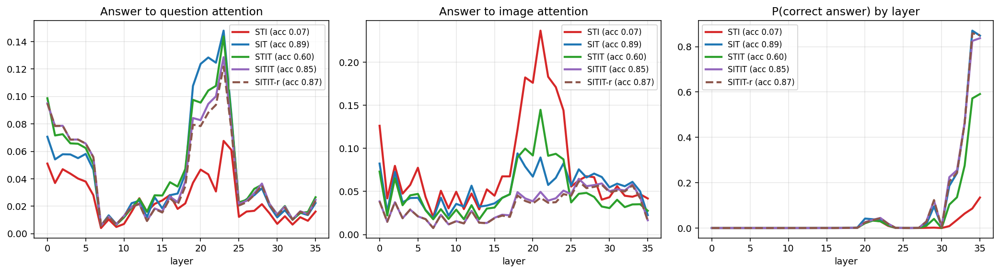

# Ask Twice, Look Twice

Code for **"Ask Twice, Look Twice: Prompt Echoing Resolves the Question-First
Paradox in Vision-Language Models"** (ECCV 2026).

*Rakshanda Hassan Abhinandan, John Galeotti, Deva Ramanan, Gautam Rajendrakumar Gare*

[Paper (PDF)](#) &nbsp;|&nbsp; [arXiv](#) &nbsp;|&nbsp; [BibTeX](#citation)

---

## Overview

Where should the question go in a vision-language model (VLM) prompt: before
the image or after it? Across NaturalBench, POPE, and Winoground,
question-first prompting consistently *underperforms* the image-first
ordering recommended for frontier VLMs — the **question-first paradox**.
Logit-lens and attention probes show a clean dissociation: a question placed
before the image genuinely **steers perception** (image patches move toward
question-relevant concepts), but the steering is thrown away downstream,
because the question is now stranded behind hundreds of image tokens and the
answer position barely attends to it. A causal attention-knockout confirms
this is not just correlational: the answer only *reads* the question when the
question follows the image.

The diagnosis yields a training-free fix, **question echoing**: restate the
question on both sides of the image, so one copy steers perception and the
other sits adjacent to the answer for read-out. **Echoing the image** as well
gives further gains by letting the second image copy attend over the entire
first copy — a bidirectional-style read obtained from a causal decoder by
repetition alone. Both are pure prompt rewrites: no training, fine-tuning, or
architecture change.

This repository contains the order-aware input builder, the benchmark
evaluators, and the mechanistic probes (perception, read-out, causal
knockout) behind every result in the paper.

<p align="center">
  
</p>

<p align="center"><sub><b>Steering happens, yet is not read out.</b> Each cell shows
the vocabulary token its image patch's final-layer hidden state decodes to under the
logit lens (Qwen3-VL). Question-last (SIT) leaves the patches generic and answers
correctly; question-first (STI) steers the <i>same</i> patches toward the question
(<i>boy, running</i> &rarr; <i>ahead, chase</i>; ringed cells decode to <i>adult,
chase, child</i>), yet answers wrong: steering happens, but is not read out.
The third panel is our fix (question echoing, STIT), the same steering now answered
correctly.</sub></p>

<p align="center">
  
</p>

<p align="center"><sub><b>The position ladder.</b> NaturalBench group accuracy climbs
question-first &rarr; question-last &rarr; echoing &rarr; image echoing, across five VLMs.</sub></p>

---

## Prompt-ordering notation

A prompt has three sections, written in token order: **S**ystem message,
**I**mage (expands to hundreds of visual tokens), **T**ask/question.
Orderings are literal letter sequences, and the `--order` flag of every
evaluator below accepts them directly:

| Order string | Sequence | Role |
|---|---|---|
| `SIT`  | System · Image · Task | question-last (the trained/default ordering) |
| `STI`  | System · Task · Image | question-first (**the paradox**) |
| `STIT` | System · Task · Image · Task | question echoing (**ours**) |
| `SITIT`| System · Image · Task · Image · Task | image echoing (**ours, best**) |
| `SITIT_rev` | as above, 2nd image reversed | ablation (§ mechanism, `SITIT-r` in the paper) |
| `SITIT_perm`| as above, 2nd image randomly permuted | control (`SITIT-p` in the paper) |
| `IST`  | Image · System · Task | supplementary: system-prompt-after-image control |

Any other letter sequence (e.g. `STITI`, `SIT`+more) is a valid `--order`
too — the input builder in `core/model_manager.py` parses it generically,
which is how the ablation table's extra orderings (Table 5 of the paper) are
produced without extra code.

---

## Key results

NaturalBench group accuracy (1,900 groups), POPE accuracy (9,000 questions),
and Winoground group accuracy (400 groups); see the paper for all five models
and full per-metric tables.

| Model | Ordering | NatBench | POPE | Wino |
|---|---|---:|---:|---:|
| Qwen3-VL-8B  | STI (Q-first) | 0.270 | 0.870 | 0.223 |
| Qwen3-VL-8B  | SIT (Q-last)  | 0.351 | 0.891 | 0.318 |
| Qwen3-VL-8B  | STIT (ours)   | 0.350 | 0.884 | 0.375 |
| Qwen3-VL-8B  | SITIT (ours)  | **0.374** | 0.889 | **0.410** |
| Gemma-3-27B  | STI (Q-first) | 0.232 | 0.840 | 0.213 |
| Gemma-3-27B  | SIT (Q-last)  | 0.226 | **0.845** | 0.208 |
| Gemma-3-27B  | STIT (ours)   | 0.253 | 0.838 | 0.253 |
| Gemma-3-27B  | SITIT (ours)  | **0.255** | 0.834 | **0.318** |

<p align="center">
  
</p>
<p align="center"><sub><b>Anatomy of the paradox.</b> Left: answer&rarr;question attention;
question-first (STI) barely reads the far-away question. Middle: answer&rarr;image
attention; STI over-attends the image instead. Right: logit-lens P(correct answer
token) by layer; the correct answer only emerges for orderings that place a question
next to the answer.</sub></p>

---

## Repository layout

```
core/                             shared library
  constants.py, utils.py            system prompt, image-token config, seeding
  model_manager.py                  order-aware input builder + model loading
                                     (Qwen3-VL, Qwen2.5-VL, InternVL3, Gemma-3, LLaVA-1.5)
  reverse_image_hooks.py            SITIT-reverse: reverse the 2nd image's patches
  permute_image_hooks.py            SITIT-permute: randomly permute the 2nd image's patches

llava/                             trimmed LLaVA-1.5 package (vendored; see Acknowledgments)

data/                               data download
  download_naturalbench.py          fetch BaiqiL/NaturalBench -> naturalbench/
  download_vqa.py                   fetch VQA v2 val questions/annotations -> vqa/
                                     (POPE and Winoground stream directly from the HF Hub)

benchmarks/                         main evaluators (all take --order, e.g. SIT,STI,STIT,SITIT)
  naturalbench_eval.py               NaturalBench: scoring, metrics, all ablation flags
                                      (--n-spaces, --resize, --image-copies, --cue-mode, --think)
  pope_eval.py                       POPE (object hallucination, yes/no)
  winoground_eval.py                 Winoground, reformulated as 4 yes/no pairs per example
  vqa_eval.py                        VQA v2, open-ended generation, official soft-accuracy
  gemma_eval.py                      Gemma-3 runner (kept separate; Gemma loads single-GPU 4-bit)

ordering_variants/                  variants not expressible via a plain --order string
  naturalbench_sitit_reverse.py      SITIT_rev on NaturalBench
  naturalbench_stiti_reverse.py      STITI_rev (question-echo ordering, image reversed)
  naturalbench_perm.py               SITIT_perm on NaturalBench
  pope_sitit_reverse.py, pope_perm.py               same, for POPE
  winoground_sitit_reverse.py, winoground_perm.py   same, for Winoground

analysis/                           mechanistic analysis
  mechanism_probe.py                 perception + read-out probe (attention, logit-lens emergence)
  decision_layer.py                  decision-layer analysis: when does the model commit?
  causal_knockout.py                 attention-knockout causal intervention (Table 2)
  qq_cosine_gen.py                   patch-perturbation cosine: how much a question rewrites the image
  patch_logitlens_gen.py             per-patch concept logit-lens heatmaps
  patchcos_contrast_gen.py           question-specific patch-perturbation heatmaps
  teaser_logitlens_gen.py            teaser figure: logit-lens insets, steered vs. unsteered
  naturalbench_tokensweep.py         token-count scaling law (the STI-SIT gap vs. vision tokens)
  winoground_stit_probe.py           mechanism probe replicated on all of Winoground

stats/                               significance
  make_significance.py               paired bootstrap CI + McNemar test per ordering gap
  make_sig_table.py                  LaTeX body for the supplementary significance table
```

Every script is runnable as a module from the repo root, e.g.
`python -m benchmarks.naturalbench_eval --order STI`.

> Datasets, model weights, and generated renders are **not** included — they
> are large and regenerable with the scripts above.

---

## Setup

```bash
conda create -n atlt python=3.10 && conda activate atlt
pip install -r requirements.txt
```

- **Qwen3-VL-8B, Qwen2.5-VL-7B, Gemma-3-27B, InternVL3-8B** are pulled from
  the Hugging Face Hub automatically (`core/model_manager.py:MODEL_PATHS`).
  Gemma-3 is gated; request access on the Hub first. Gemma-3-27B loads 4-bit
  on a single GPU (`device_map={"": 0}`) — do **not** shard it across GPUs
  with `device_map="auto"`, which produces NaN logits without NVLink.
- **LLaVA-1.5-7B**: download [liuhaotian/llava-v1.5-7b](https://huggingface.co/liuhaotian/llava-v1.5-7b)
  and point `MODEL_PATHS["llava-1.5"]` at it. Being single-image, the
  image-echoing orderings (`SITIT`, `SITIT_rev`) do not apply to it.
- **COCO val2014** images (used by VQA v2 and referenced by some analysis
  scripts): download from [cocodataset.org](https://cocodataset.org/#download)
  and place/symlink at `./COCO/val2014/`.

All runs use greedy decoding, a 16-token answer budget (512 with `--think`),
and the fixed system prompt in `core/constants.py`. All commands below are run
from the repo root.

---

## Usage

### Main results (Table 3)

```bash
python -m data.download_naturalbench                 # 1,900 groups

CUDA_VISIBLE_DEVICES=0 python -m benchmarks.naturalbench_eval \
    --model qwen3-vl-8b --order SIT,STI,STIT,SITIT --num-groups 1900

CUDA_VISIBLE_DEVICES=0 python -m benchmarks.pope_eval       --model qwen3-vl-8b --order SIT,STI,STIT
CUDA_VISIBLE_DEVICES=0 python -m benchmarks.winoground_eval --model qwen3-vl-8b --order SIT,STI,STIT

# Gemma-3-27B uses the dedicated runner (single-GPU 4-bit load)
CUDA_VISIBLE_DEVICES=0 python -m benchmarks.gemma_eval --model gemma-3-27b --order SIT,STI,STIT,SITIT --num-groups 1900

# Reversed / permuted image-echoing controls
CUDA_VISIBLE_DEVICES=0 python -m ordering_variants.naturalbench_sitit_reverse --num-groups 1900
CUDA_VISIBLE_DEVICES=0 python -m ordering_variants.naturalbench_perm          --num-groups 1900
```

Runs are resumable (checkpointed every `--checkpoint-every` groups) and
write `<model>__<order>__{results,correct,wrong}.json` to `--out-dir`.

### Open-ended VQA (Table 4)

```bash
python -m data.download_vqa
CUDA_VISIBLE_DEVICES=0 python -m benchmarks.vqa_eval --num-samples 2000 --model qwen3-vl-8b --order STI,SIT,STIT,SITIT
```

### Ablations (Table 6) — all via `benchmarks.naturalbench_eval` flags

```bash
# image copies / mean-resize (not more tokens)
python -m benchmarks.naturalbench_eval --order STI --image-copies 2
python -m benchmarks.naturalbench_eval --order STI --resize 224x224

# padding (not more compute)
python -m benchmarks.naturalbench_eval --order STI --n-spaces 20

# short cue vs. full echoed question
python -m benchmarks.naturalbench_eval --order STIT --cue-mode

# chain-of-thought
python -m benchmarks.naturalbench_eval --order STIT --think

# generic orderings, e.g. STITI (echo image in STI units)
python -m benchmarks.naturalbench_eval --order STITI
```

### Mechanistic analysis (Figures 3, 4; Table 2)

```bash
CUDA_VISIBLE_DEVICES=0 python -m analysis.mechanism_probe --num-pairs 150    # perception + read-out probe
CUDA_VISIBLE_DEVICES=0 python -m analysis.decision_layer                     # when the model commits
CUDA_VISIBLE_DEVICES=0 python -m analysis.causal_knockout --num-pairs 250    # causal attention knockout
CUDA_VISIBLE_DEVICES=0 python -m analysis.naturalbench_tokensweep --num-groups 400 --res 224,336,448,560,672
```

### Significance tests

```bash
python -m stats.make_significance     # paired bootstrap CI + McNemar per gap
python -m stats.make_sig_table        # LaTeX body for the supplementary significance table
```

---

## Citation

```bibtex
@inproceedings{abhinandan2026asktwice,
  title     = {Ask Twice, Look Twice: Prompt Echoing Resolves the Question-First Paradox in Vision-Language Models},
  author    = {Abhinandan, Rakshanda Hassan and Galeotti, John and Ramanan, Deva and Gare, Gautam Rajendrakumar},
  booktitle = {ECCV Workshops},
  year      = {2026}
}
```

## Acknowledgments

The logit-lens machinery in `analysis/` builds on the codebase of
[ZhangqiJiang07/middle_layers_indicating_hallucinations](https://github.com/ZhangqiJiang07/middle_layers_indicating_hallucinations),
which accompanies *"Devils in Middle Layers of Large Vision-Language Models:
Interpreting, Detecting and Mitigating Object Hallucinations via Attention
Lens"* (Jiang et al., CVPR 2025, [arXiv:2411.16724](https://arxiv.org/abs/2411.16724)),
which in turn borrows from [LALBJ/PAI](https://github.com/LALBJ/PAI) and
[VLM-Visualizer](https://github.com/zjysteven/VLM-Visualizer). The vendored
`llava/` package builds on [haotian-liu/LLaVA](https://github.com/haotian-liu/LLaVA)
via PAI. Benchmarks:
[NaturalBench](https://linzhiqiu.github.io/papers/naturalbench/) (Lin et al.,
NeurIPS 2024), [POPE](https://github.com/RUCAIBox/POPE) (Li et al., EMNLP
2023), [Winoground](https://huggingface.co/datasets/facebook/winoground)
(Thrush et al., CVPR 2022), and [VQA v2](https://visualqa.org/) (Goyal et
al., CVPR 2017).
